# RabbitMQ

## What is RabbitMQ
* AMPQ = Advanced Message Queue Protocol
* Reliability
* Routing
* Clustering and High Availability
* Management Web Interface
* CLI
* Cross Platform
* FIFO
* Binding is linking Exchange > Queue

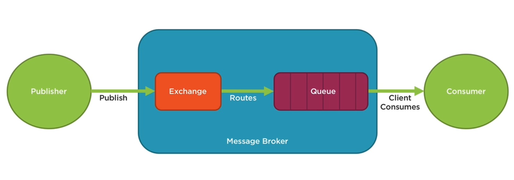


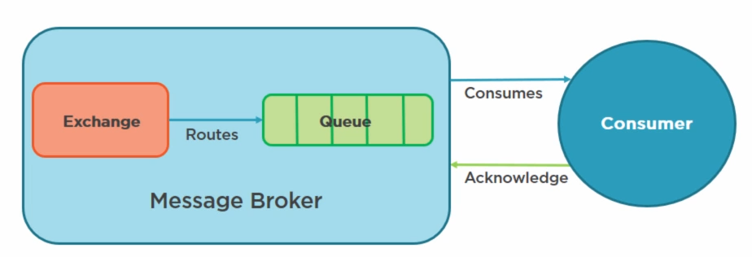

## Installing Server
1. Install RabbitMQ - https://www.rabbitmq.com/install-windows.html
2. Install Erlang - https://www.erlang.org/downloads
3. Install the Management UI by running the following commands
```
cd C:\Program Files\RabbitMQ Server\rabbitmq_server-3.7.9\sbin
rabbitmq-plugins.bat enable rabbitmq_management
rabbitmq-service.bat stop  
rabbitmq-service.bat install  
rabbitmq-service.bat start
```
4. Launch http://localhost:15672/#/
```
Username: guest
Password: guest
```

## EasyNetQ
* http://easynetq.com/

## Exchanges
1. Direct Exchange
2. Fanout Exchange
3. Topic Exchange
4. Headers Exchange

* Name = Name of the exchange. Default is ""
* Durability = Persist message to disk
* Auto Delete = Delete exchange after use
* Arguments = Message broker dependent arguemnets

### Direct Exchange
* Routing Key = Queue Name by default
* Like MSMQ

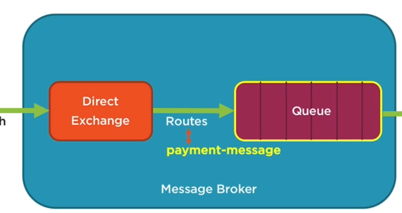

### Fanout Exchange
* Queues bound to exchange
* Routing key ignored
* Broadcasts

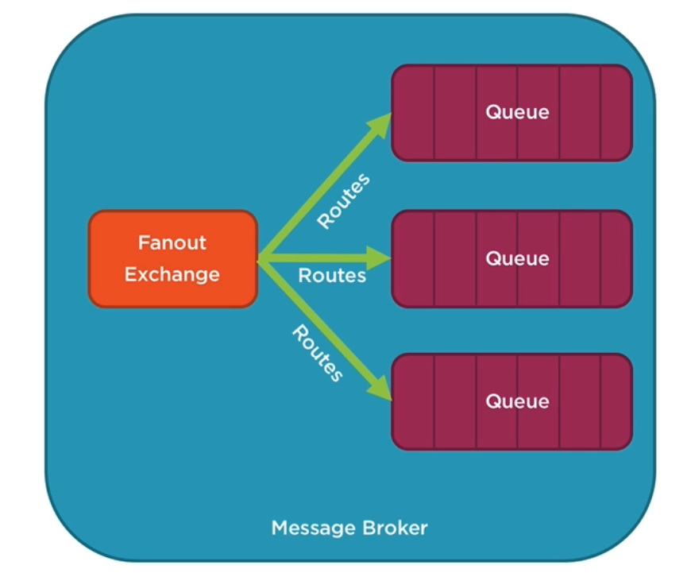

### Topic Exchange
* Different Queue based on Routing Key pattern
* all.*.* will get sent to all queues
* all.payroll.* will get sent to payroll queue
* If a queue is bound with the # routing key it will receive all messages like fanout exchange.

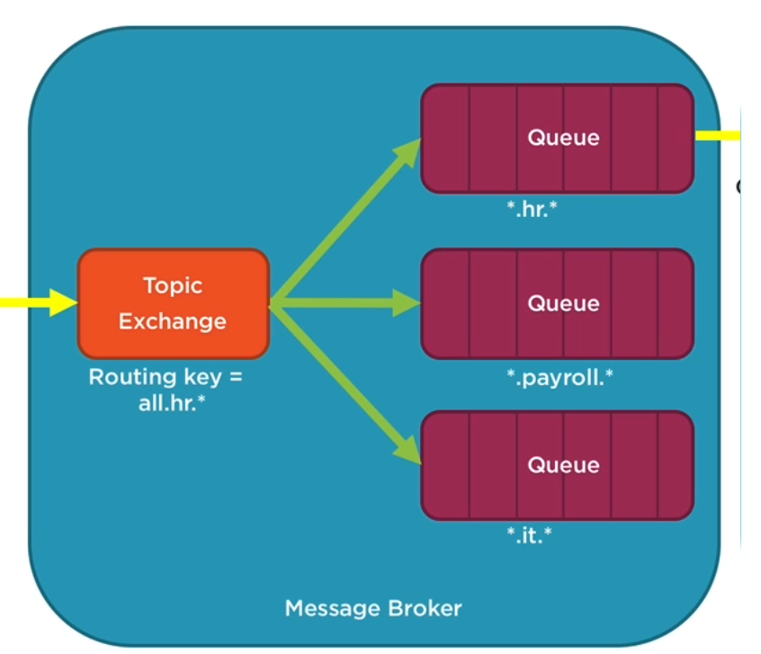

### Headers Exchange
* Routing key ignored
* Routing based on attributes
* Turbo Charged version of direct exchange

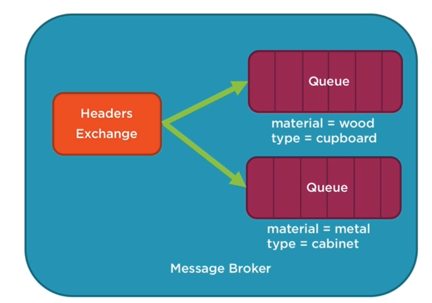

## Queues 
* Name = Name of the queue
* Durability = Persist queue and messages to disk
* Exclusive = Delete queue after use
* Auto Delete = Delete exchange after use

## Patterns
1. Publish and Subscribe
2. Request and Response
3. Send and Receive
4. Topic based Publish and Subscribe

### Publish and Subscribe
* Decouple sender from receiver
* Message disappears if there are no subscribers
* With EasyNetQ you create a single connection for the life time of the application
* [Queue("CardPaymentQueue", ExchangeName = "CardPaymentExchange")]
```
using (var bus = RabbitHutch.CreateBus("host=localhost;publishederConfirms=true;timeout=10;username=guest;password=guest"))
{
    Publish(bus, message);
}

public static void Publish(IBus bus, IDomainEvent message)
{
    bus.PublishAsync<IDomainEvent>(message).ContineWith(task => {
        if (task.isCompleted && !task.IsFaulted)
        {
            Console.WriteLine("Task Compelted.");
        }
        if(task.isFaulted)
        {
            Console.WriteLine(task.Exception);
        }
    })
}
```
```
using (var bus = RabbitHutch.CreateBus("host=localhost;publishederConfirms=true;timeout=10;username=guest;password=guest"))
{
    bus.Subscribe<IDomainEvent>("integration", message => HandleMessage(message));
}

private static void HandleMessage(IDomainEvent message)
{

}
```
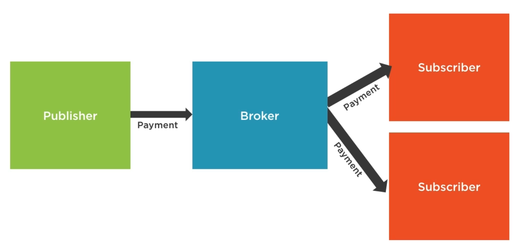

### Request and Response
* Remote procedure calls (RPC)
#### Sync
```
using (var bus = RabbitHutch.CreateBus("host=localhost;publishederConfirms=true;timeout=10;username=guest;password=guest"))
{
    var response = bus.Request<RequestMessage, ResponseMessage>(requestMessage);
}
```
```
using (var bus = RabbitHutch.CreateBus("host=localhost;publishederConfirms=true;timeout=10;username=guest;password=guest"))
{
    bus.Respond<RequestMessage, ResponseMessage>(Responder);
}

public static ResponseMessage Responder(RequestMessage request)
{
    return new ResponseMessage();
}
```
#### Async
```
using (var bus = RabbitHutch.CreateBus("host=localhost;publishederConfirms=true;timeout=10;username=guest;password=guest"))
{
    var response = await bus.RequestAsync<RequestMessage, ResponseMessage>(requestMessage);
}
```
```
public  class MyWorker
{
    public CardPaymentResponseMessage Execute(CardPaymentRequestMessage request)
    {
        CardPaymentResponseMessage responseMessage = new CardPaymentResponseMessage();
        responseMessage.AuthCode = "1234";
        Console.WriteLine("Worker activated to process response.");

        return responseMessage;
    }
}
var workers = new BlockingCollection<MyWorker>();
for (int i = 0; i < 10; i++)
{
    workers.Add(new MyWorker());
}
      
using (var bus = RabbitHutch.CreateBus("host=localhost;publishederConfirms=true;timeout=10;username=guest;password=guest"))
{
    bus.RespondAsync<RequestMessage, ResponseMessage>(request =>
                    Task.Factory.StartNew(() =>
                    {
                        var worker = workers.Take();
                        try
                        {
                            return worker.Execute(request);
                        }
                        finally
                        {
                            workers.Add(worker);
                        }
                    }));
}
```
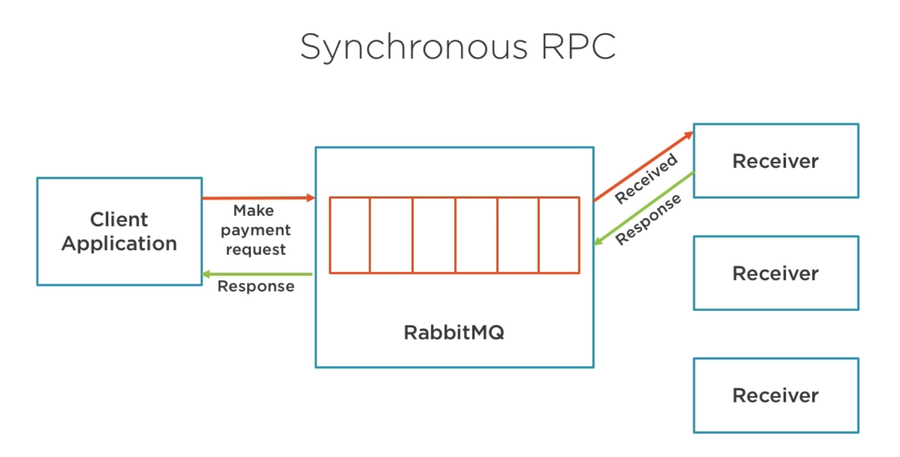

### Send and Receive
* Like Publish/Subscribe but messages aren't discarded if there are no listeners.
* Good pattern for using in production.

#### Sync
```
using (var bus = RabbitHutch.CreateBus("host=localhost;publishederConfirms=true;timeout=10;username=guest;password=guest"))
{
    bus.Send("queueName", requestMessage);
    bus.Send("queueName", requestMessage2);
}
```
```
using (var bus = RabbitHutch.CreateBus("host=localhost;publishederConfirms=true;timeout=10;username=guest;password=guest"))
{
    bus.Receive<ResponseMessage>("queueName", Responder);
}

using (var bus = RabbitHutch.CreateBus("host=localhost;publishederConfirms=true;timeout=10;username=guest;password=guest"))
{
    bus.Receive("queueName", x => x
        .Add<RequestMessage>(Responder1)
        .Add<RequestMessage2>(Responder2)  
    );
}


```

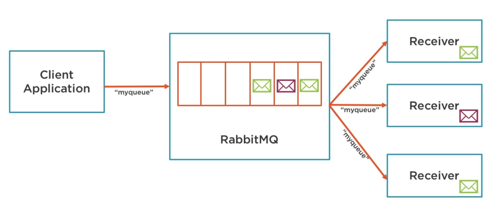

### Topic based Publish and Subscribe
* Routing Keys seperated by dots. e.g payment.cardpayment
* '*' can substitute for exactly one word
* '#' can substitute for zero or more words
```
using (var bus = RabbitHutch.CreateBus("host=localhost;publishederConfirms=true;timeout=10;username=guest;password=guest"))
{
    Publish(bus, message);
}

public static void Publish(IBus bus, IDomainEvent message)
{
    bus.PublishAsync<IDomainEvent>(message,"payment.message");
    bus.PublishAsync<IDomainEvent>(message2,"payment.message2");
}
```
```
using (var bus = RabbitHutch.CreateBus("host=localhost;publishederConfirms=true;timeout=10;username=guest;password=guest"))
{
    bus.Subscribe<IDomainEvent>("integration", Handler, x => x.WithTopic("payment.message"));
}

```
```
using (var bus = RabbitHutch.CreateBus("host=localhost;publishederConfirms=true;timeout=10;username=guest;password=guest"))
{
    bus.Subscribe<IDomainEvent>("integration2", Handler, x => x.WithTopic("payment.message2"));
}

```
```
using (var bus = RabbitHutch.CreateBus("host=localhost;publishederConfirms=true;timeout=10;username=guest;password=guest"))
{
    bus.Subscribe<IDomainEvent>("accounts", Handler, x => x.WithTopic("payment.*"));
}

```

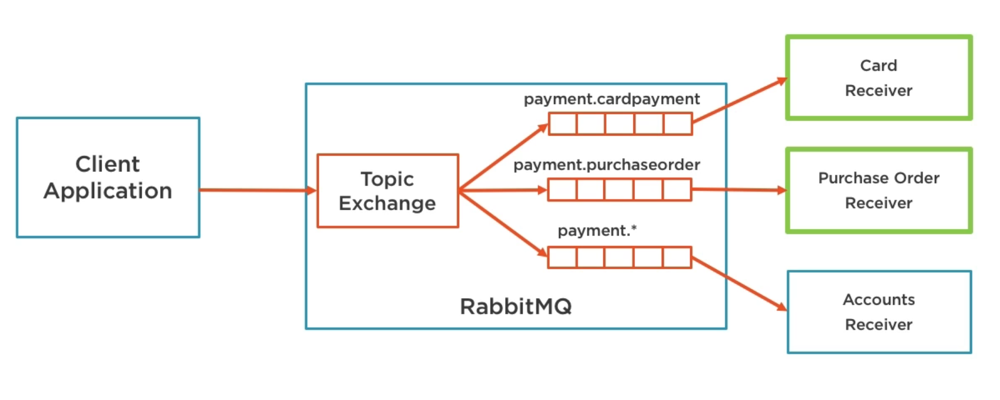

## Scaling 

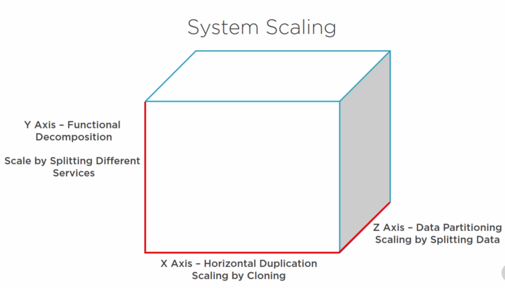